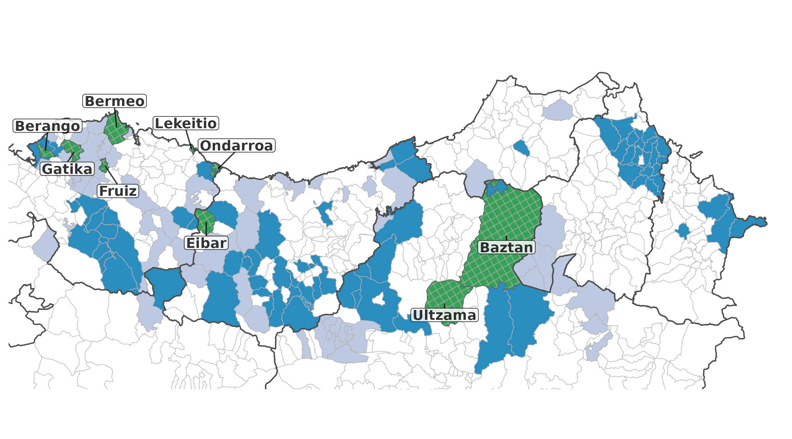

# Euskararen intonazioaren aldakortasuna: monografien ekarpena

Euskal hizkerak deskribatzen dituzten monografien datu-base bat osatu dut, eta alderdi prosodikoek (azentuak, intonazioak) duten tokia neurtu.

Fitxategien azalpena:

- [`doima.bib`](doima.bib): xehetasun bibliografikoak.
- [`doima.tsv`](doima.tsv): monografia bakoitzak alderdi prosodikoei eskaintzen dien tartea zehazten da.

Lagineko monografien hedadura geografikoa.

- Urdin argiz diren herrietako monografiek ez dute deskribapen prosodikorik.
- Urdin ilunez diren horietan, hitz-mailako azentuari heltzen zaio, baina ez intonazioari.
- Berdez eta herriaren izenarekin agertzen direnak dira intonazioa jorratzen duten bakarrak.
